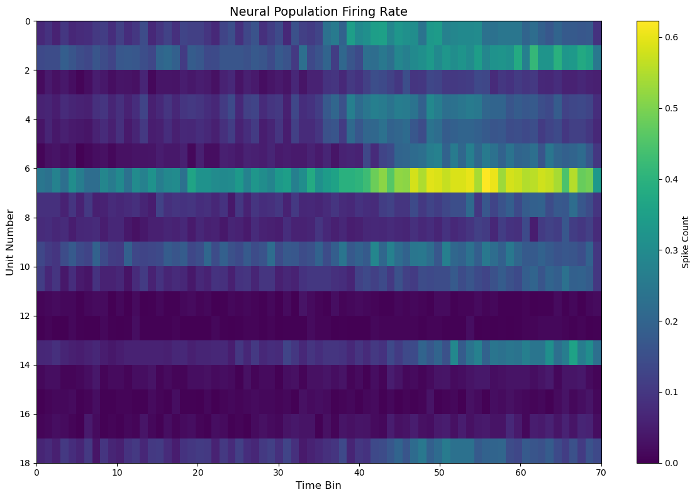
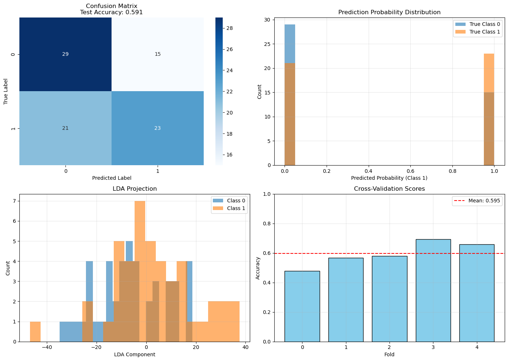
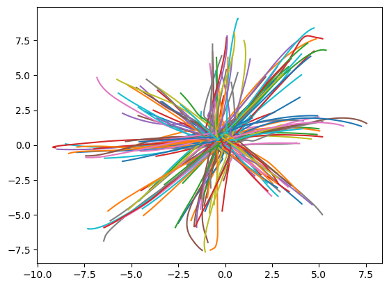

# Neural Data Pipeline

This repository is a personal portfolio adaptation of a University of Washington team project on analyzing human and monkey neural recordings from NWB-formatted datasets.

This version focuses on my individual contributions: functional specifications, test design, and reproducibility-oriented project structure.

## Project Overview

The original team project analyzes neural recordings from human and monkey datasets and provides reusable code for loading, formatting, analysis, and visualization.

The project package includes modules for:
- data loading from structured neuroscience datasets  
- data formatting for analysis-ready structures  
- analytical processing  
- visualization of neural activity 
- configuration-driven workflows  

## My Contribution

My primary contributions include:
- defining functional specifications across modules
- translating requirements into testable system behavior  
- designing and implementing tests
- improving reproducibility and maintainability  

## More details:
- `docs/my_contribution.md`
- `docs/functional_spec_summary.md`
- `docs/testing_strategy.md`

## System Design

The system follows a modular pipeline:

Data Loading → Data Formatting → Analysis → Visualization

Each stage is designed to:
- produce consistent outputs  
- handle edge cases  
- support downstream components  

## Testing & CI

This project includes automated testing using GitHub Actions across multiple Python versions.

Testing strategy includes:

- **Smoke Tests**  
  Validate that the full pipeline runs end-to-end  

- **Unit Tests**  
  Verify correctness of individual functions  

- **Integration Tests**  
  Ensure modules work together correctly  

- **Edge Case Testing**  
  Validate robustness under unexpected inputs  

These tests help ensure:
- correctness  
- reproducibility  
- system reliability  

---
## Example Outputs

### Firing Rate Heatmap

This heatmap visualizes neural firing rates across neurons and time, highlighting activity patterns and temporal dynamics in the dataset.

### LDA-Based Movement Classification

This visualization shows how neural activity can be used to distinguish between different movement categories, demonstrating the predictive signal contained in neural features.

### Cursor Movement Trajectories

This plot shows movement trajectories across trials, providing insight into behavioral variability and structure in the data.

Additional figures are available in `results/figures/`.

## Why This Project Matters

This project demonstrates skills relevant to data, engineering, and AI workflows:
- working with scientific and structured data systems
- designing modular and reproducible pipelines  
- translating ambiguous requirements into testable logic  
- implementing validation strategies for reliable systems 

## Repository Structure

- `src/` – core package  
- `tests/` – test suite  
- `examples/` – usage examples  
- `docs/` – specifications and testing explanations  

## Note

This repository is adapted from a team project and is intended to present my individual contributions in a clearer portfolio format.

